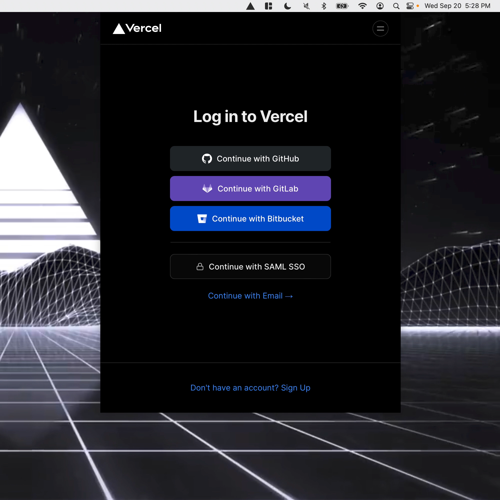

# vercel-dashboard-mba

> Use the Vercel dashboard from your menu bar

`vercel-dashboard-mba` is a Menu Bar App for the Vercel dashboard: https://vercel.com/dashboard

It enables you to use the Vercel dashboard directly from your menu bar, making it easy to check your deployments and manage your Vercel projects.

*Note: This project is not affiliated with Vercel.*

<p align="center">
  
</p>

## Features

- One-click access to the Vercel dashboard
- Runs on Windows, Mac & Linux
- ▲ icon in your menu bar

## Prerequisites

- [Rust](https://www.rust-lang.org)
- [Tauri](https://tauri.app)

## Running the application

To run `vercel-dashboard-mba`:

```sh
pnpm install
pnpm tauri dev
```

## Contribute

To contribute to this project, kindly [fork the repository](https://github.com/ctate/vercel-dashboard-mba/fork) and submit a pull request containing your modifications.

## License

[MIT](https://github.com/ctate/vercel-dashboard-mba/blob/main/LICENSE)

## Acknowledgements

Thank you [Vercel](https://vercel.com) ▲
